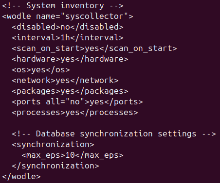

# Практическое задание №3. Wazuh

## Развернутые виртуальные машины (сервер и клиент)

## Сетевой обмен между виртуальными машинами

## Развертывание сервера Wazuh

## Веб-интерфейс Wazuh

## Установка агента Wazuh

## Подключенный агент

## Найденные уязвимости в конфигурации по умолчанию

## Настройка проверки целостности файлов

## Настройка выявление уязвимостей в соответствии с документацией

## Настройка выявления скрытых процессов

## Настройка выявления SQL-инъекций

### Установка веб-сервера Apache

### Конфигурация мониторинга логов Apache

### Пример атаки

### Работа настроенного механизма

