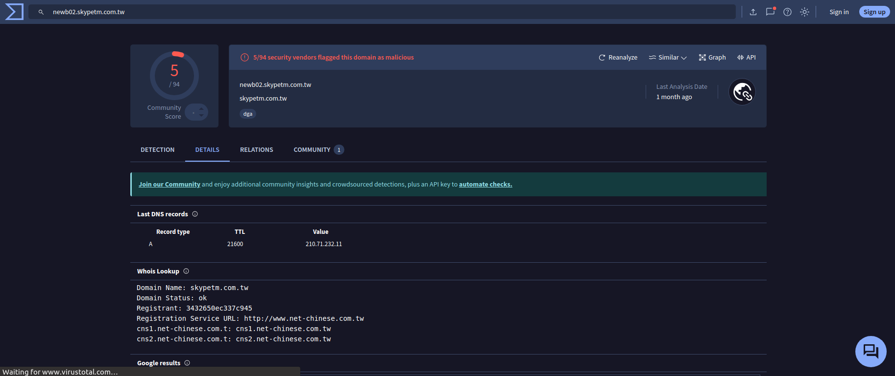

# Практическое задание №4. Network Threat Hunting

## Часть №1

### Выбор датасета для дальнейшего анализа

### Добавление в safelist адреса Skype

### Импорт логов

### Первая запись 

- Множество подключений за последние 24 часа (3 011).
- Гистограмма достаточно ровная.
- Пользовательский агент идентифицируется как Windows 7 (может быть легитимным, однако является устаревшим).
- Отсутствует строка хостинга. Необходимо указать полное доменное имя веб-сервера.

### Вторая запись 

- Является узлом оптимизации доставки MS, который используется для установки исправлений
- Цифровой сертификат вполне легитимный, следовательно, можно внести данную запись в safelist

### Третья запись

Данная запись является легитимным доменом Microsoft, поэтому можно внести в safelist

### Четвертая запись

Аналогичной второй записи

### Пятая запись

Аналогично третьей записи

### Итоговый safelist

### Длительные подключения

### Просмотр записей с помощью VirusTotal

## Часть №2

### Импорт логов

### Выбор датасета для дальнейшего анализа

### Переходим во вкладку DNS

Можно заметить большое количество обращений на различные поддомены honestimnotevil.com. Это может указывать на потенциальный C2 через DNS.

## Часть №3

### Импорт логов

### Выбор датасета для дальнейшего анализа

### Данная запись имеет нестандартный для Skype домен

### Просмотр записи через VirusTotal

### В длительных подключениях аналогичная с первой частью ситуация 

- Гистограмма плоская.
- Пользовательский агент и FQDN выглядит ненастоящим.
