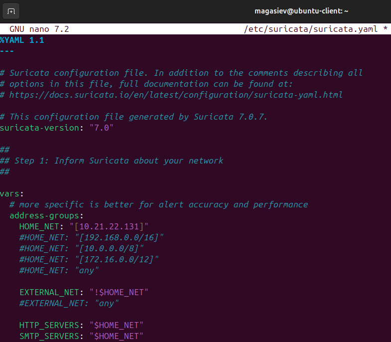

# Практическое задание №5. Threat Hunting

Для выполнения работы был использован стенд Wazuh из практической работы №3.

## Установка и настройка IDS Suricata

Добавление репозитория в пакетный менеджер

Скачивание правил обнаружения

Изменение конфигурации Suricata

Настройка импорта логов Suricata в Wazuh

## Пример атаки

На агенте был развернут простой веб-сервер Apache

С помощью сканера веб-уязвимостей `nuclei` было выполнено сканирование агента

События Suricata, отображаемые в Wazuh

## Установка и настройка Yara

Скачивание, компиляция и установка Yara

Скачивание Yara-правил

Создание скрипта `yara.sh`

Изменение конфига `ossec` на агенте

Изменение файлов конфигурации на сервере

